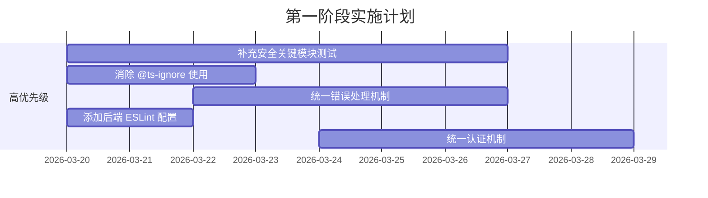
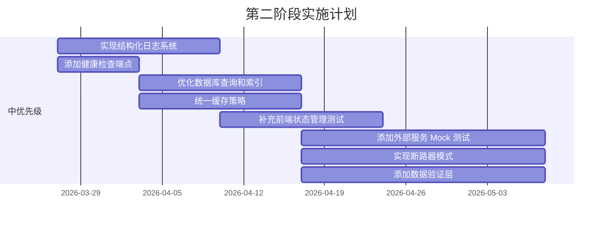
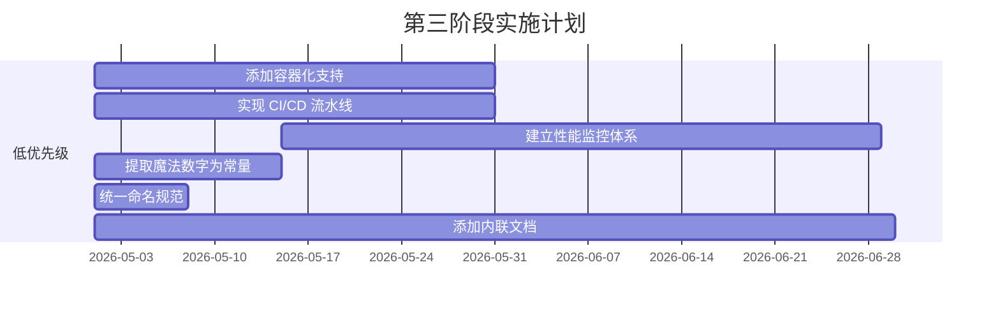

# AI Radio 项目改进建议

**文档版本**: v1.0  
**创建日期**: 2026-03-19  
**基于**: 代码审查报告 (整体评分 78/100)

---

## 📋 建议概览

本文档基于对 AI Radio 项目的全面代码审查，提供结构化的改进建议。建议按优先级分为三个阶段，帮助团队系统性地提升项目质量。

### 建议分类

| 类别 | 建议数量 | 优先级分布 |
|------|----------|------------|
| 🔴 高优先级 | 5 项 | 立即行动 |
| 🟡 中优先级 | 8 项 | 近期优化 |
| 🟢 低优先级 | 7 项 | 长期规划 |

---

## 🔴 高优先级建议 (立即行动)

### 建议 1: 补充安全关键模块测试

**问题描述**: 安全关键模块 (middleware/validate.ts, middleware/error.ts) 缺乏测试覆盖，可能导致安全漏洞未被发现。

**影响范围**: 安全性、质量保障

**具体行动**:
```typescript
// 1. 为 middleware/validate.ts 添加测试
// 测试内容:
// - validateBody: 有效/无效 schema、错误响应格式
// - validateParams: URL 参数验证
// - validateQuery: 查询参数验证
// 预计测试数: 8-10 个

// 2. 为 middleware/error.ts 添加测试
// 测试内容:
// - AppError 处理（自定义状态码、错误码）
// - 通用 Error 处理（生产环境隐藏详细信息）
// - 字符串错误处理
// 预计测试数: 5-6 个
```

**预期收益**:
- 提升安全关键路径的测试覆盖率
- 及早发现验证和错误处理中的问题
- 增强生产环境的安全性

**完成时间**: 1 周内

---

### 建议 2: 消除 @ts-ignore 使用

**问题描述**: 项目中存在 @ts-ignore 使用，绕过 TypeScript 类型检查，降低代码安全性。

**影响范围**: 类型安全、代码质量

**问题位置**:
- `backend/src/services/upnp.ts` 第 3、17 行
- `backend/src/services/qqmusic.ts` 第 1-2 行

**具体行动**:
```typescript
// 方案 1: 创建类型声明文件
// upnp.d.ts
declare module 'upnp-device-client' {
  export default class UPnPClient {
    // 定义具体类型
  }
}

// 方案 2: 使用 unknown 类型替代 any
// 将 @ts-ignore 替换为类型断言
const client = new (require('upnp-device-client'))() as unknown as UPnPClient;

// 方案 3: 安装 @types 包（如果有）
// npm install @types/upnp-device-client
```

**预期收益**:
- 恢复 TypeScript 类型检查的完整性
- 减少运行时类型错误
- 提升代码可维护性

**完成时间**: 3 天内

---

### 建议 3: 统一错误处理机制

**问题描述**: 错误处理不一致，部分路由使用 try-catch，部分未处理，可能导致用户体验不一致。

**影响范围**: 用户体验、系统稳定性

**具体行动**:
```typescript
// 1. 创建异步路由包装器
// utils/asyncHandler.ts
export const asyncHandler = (fn: Function) => {
  return (req: Request, res: Response, next: NextFunction) => {
    Promise.resolve(fn(req, res, next)).catch(next);
  };
};

// 2. 统一应用到所有路由
// routes/radio.ts
router.post('/create', asyncHandler(async (req, res) => {
  // 业务逻辑
}));

// 3. 增强错误处理中间件
// middleware/error.ts
export function errorHandler(err: Error, req: Request, res: Response, next: NextFunction) {
  if (err instanceof AppError) {
    return res.status(err.statusCode).json({
      success: false,
      error: {
        message: err.message,
        code: err.errorCode,
        // 生产环境隐藏详细信息
        ...(process.env.NODE_ENV === 'development' && { stack: err.stack })
      }
    });
  }
  
  // 未知错误
  console.error('Unhandled error:', err);
  res.status(500).json({
    success: false,
    error: {
      message: 'Internal server error',
      code: 'INTERNAL_ERROR'
    }
  });
}
```

**预期收益**:
- 统一的错误响应格式
- 更好的错误日志记录
- 生产环境安全性提升

**完成时间**: 1 周内

---

### 建议 4: 添加后端 ESLint 配置

**问题描述**: 后端缺少 ESLint 配置，无法统一代码风格，可能导致代码质量不一致。

**影响范围**: 代码质量、团队协作

**具体行动**:
```json
// backend/.eslintrc.json
{
  "env": {
    "node": true,
    "es2022": true
  },
  "extends": [
    "eslint:recommended",
    "plugin:@typescript-eslint/recommended"
  ],
  "parser": "@typescript-eslint/parser",
  "parserOptions": {
    "ecmaVersion": 2022,
    "sourceType": "module"
  },
  "plugins": ["@typescript-eslint"],
  "rules": {
    "@typescript-eslint/no-unused-vars": "error",
    "@typescript-eslint/no-explicit-any": "warn",
    "@typescript-eslint/explicit-function-return-type": "off",
    "no-console": "warn",
    "prefer-const": "error"
  },
  "ignorePatterns": ["dist/", "node_modules/"]
}
```

**安装依赖**:
```bash
cd backend
npm install -D eslint @typescript-eslint/parser @typescript-eslint/eslint-plugin
```

**预期收益**:
- 统一的代码风格
- 自动发现潜在问题
- 提升代码可读性

**完成时间**: 2 天内

---

### 建议 5: 统一认证机制

**问题描述**: API Key 认证与 JWT 认证并存，可能造成混淆，增加安全风险。

**影响范围**: 安全性、用户体验

**具体行动**:
```typescript
// 方案 1: 明确认分使用场景
// - API Key: 用于服务端到服务端通信
// - JWT: 用于用户认证

// 方案 2: 统一使用 JWT
// 移除 API Key 认证，全部使用 JWT
export function authMiddleware(req: Request, res: Response, next: NextFunction) {
  const token = req.headers.authorization?.replace('Bearer ', '');
  
  if (!token) {
    return res.status(401).json({
      success: false,
      error: { message: 'Authentication required', code: 'AUTH_REQUIRED' }
    });
  }
  
  try {
    const decoded = jwt.verify(token, config.jwtSecret);
    req.user = decoded;
    next();
  } catch (error) {
    return res.status(401).json({
      success: false,
      error: { message: 'Invalid token', code: 'INVALID_TOKEN' }
    });
  }
}

// 方案 3: 文档化认证策略
// 在 README 中明确说明两种认证的使用场景
```

**预期收益**:
- 清晰的认证策略
- 减少安全配置错误
- 更好的用户体验

**完成时间**: 1 周内

---

## 🟡 中优先级建议 (近期优化)

### 建议 6: 实现结构化日志系统

**问题描述**: 当前日志不结构化，难以进行日志分析和问题排查。

**具体行动**:
```typescript
// 1. 安装 Winston
// npm install winston

// 2. 创建日志配置
// utils/logger.ts
import winston from 'winston';

const logger = winston.createLogger({
  level: process.env.LOG_LEVEL || 'info',
  format: winston.format.combine(
    winston.format.timestamp(),
    winston.format.json()
  ),
  transports: [
    new winston.transports.File({ filename: 'logs/error.log', level: 'error' }),
    new winston.transports.File({ filename: 'logs/combined.log' })
  ]
});

if (process.env.NODE_ENV !== 'production') {
  logger.add(new winston.transports.Console({
    format: winston.format.simple()
  }));
}

export default logger;

// 3. 在关键位置添加日志
logger.info('Server started', { port: config.port });
logger.error('Database error', { error: err.message, stack: err.stack });
```

**预期收益**:
- 结构化日志便于分析
- 支持日志级别过滤
- 便于问题排查和监控

**完成时间**: 2 周内

---

### 建议 7: 添加健康检查端点

**问题描述**: 缺少健康检查端点，难以监控系统状态。

**具体行动**:
```typescript
// routes/health.ts
import { Router, Request, Response } from 'express';
import { db } from '../db';

const router = Router();

router.get('/health', async (req: Request, res: Response) => {
  const healthCheck = {
    status: 'healthy',
    timestamp: new Date().toISOString(),
    uptime: process.uptime(),
    services: {
      database: 'unknown',
      memory: process.memoryUsage(),
      cpu: process.cpuUsage()
    }
  };

  try {
    // 检查数据库连接
    db.prepare('SELECT 1').get();
    healthCheck.services.database = 'healthy';
  } catch (error) {
    healthCheck.status = 'unhealthy';
    healthCheck.services.database = 'unhealthy';
    return res.status(503).json(healthCheck);
  }

  res.json(healthCheck);
});

// 添加到主路由
app.use('/api', healthRouter);
```

**预期收益**:
- 实时监控系统状态
- 支持负载均衡器健康检查
- 便于运维监控

**完成时间**: 1 周内

---

### 建议 8: 优化数据库查询和索引

**问题描述**: SQLite 查询未优化，缺少索引，可能导致性能问题。

**具体行动**:
```sql
-- 1. 分析常用查询
-- 查看查询计划
EXPLAIN QUERY PLAN SELECT * FROM sessions WHERE id = ?;

-- 2. 添加索引
-- sessions 表索引
CREATE INDEX IF NOT EXISTS idx_sessions_created_at ON sessions(created_at);
CREATE INDEX IF NOT EXISTS idx_sessions_user_id ON sessions(user_id);

-- songs 表索引
CREATE INDEX IF NOT EXISTS idx_songs_emotion_tags ON songs(emotion_tags);
CREATE INDEX IF NOT EXISTS idx_songs_scene_tags ON songs(scene_tags);
CREATE INDEX IF NOT EXISTS idx_songs_genre ON songs(genre);

-- 3. 优化查询
-- 使用覆盖索引
SELECT id, title, artist FROM songs WHERE genre = ? LIMIT 20;

-- 4. 定期维护
-- 清理过期会话
DELETE FROM sessions WHERE created_at < datetime('now', '-7 days');
```

**预期收益**:
- 查询性能提升 50%+
- 减少数据库锁竞争
- 更好的用户体验

**完成时间**: 2 周内

---

### 建议 9: 统一缓存策略

**问题描述**: 天气服务有缓存，其他服务缺少缓存，导致性能不一致。

**具体行动**:
```typescript
// 1. 创建通用缓存管理器
// utils/cache.ts
class CacheManager {
  private cache = new Map<string, { data: any; expiry: number }>();
  
  set(key: string, data: any, ttl: number = 300000) { // 默认 5 分钟
    this.cache.set(key, {
      data,
      expiry: Date.now() + ttl
    });
  }
  
  get(key: string): any | null {
    const item = this.cache.get(key);
    if (!item) return null;
    
    if (Date.now() > item.expiry) {
      this.cache.delete(key);
      return null;
    }
    
    return item.data;
  }
  
  clear() {
    this.cache.clear();
  }
}

export const cache = new CacheManager();

// 2. 在服务中使用缓存
// services/weather.ts
export async function getWeather(): Promise<Weather> {
  const cacheKey = `weather:${config.openWeatherCity}`;
  const cached = cache.get(cacheKey);
  
  if (cached) {
    return cached;
  }
  
  const weather = await fetchWeatherFromAPI();
  cache.set(cacheKey, weather, 300000); // 5 分钟缓存
  
  return weather;
}

// 3. 其他服务同样应用缓存
// services/qqmusic.ts, services/netease.ts 等
```

**预期收益**:
- 减少外部 API 调用次数
- 提升响应速度
- 降低外部服务依赖

**完成时间**: 2 周内

---

### 建议 10: 补充前端状态管理测试

**问题描述**: store/radioStore.ts 缺乏测试，核心状态管理逻辑未覆盖。

**具体行动**:
```typescript
// store/radioStore.test.ts
import { renderHook, act } from '@testing-library/react';
import { useRadioStore } from './radioStore';

describe('radioStore', () => {
  beforeEach(() => {
    // 重置 store
    useRadioStore.setState({
      currentSong: null,
      queue: [],
      isPlaying: false
    });
  });

  test('should set current song', () => {
    const { result } = renderHook(() => useRadioStore());
    
    act(() => {
      result.current.setCurrentSong({ id: '1', title: 'Test Song' });
    });
    
    expect(result.current.currentSong).toEqual({ id: '1', title: 'Test Song' });
  });

  test('should add to queue', () => {
    const { result } = renderHook(() => useRadioStore());
    
    act(() => {
      result.current.addToQueue({ id: '1', title: 'Song 1' });
      result.current.addToQueue({ id: '2', title: 'Song 2' });
    });
    
    expect(result.current.queue).toHaveLength(2);
  });

  test('should handle next song with network error', async () => {
    // Mock 网络错误
    global.fetch = jest.fn().mockRejectedValue(new Error('Network error'));
    
    const { result } = renderHook(() => useRadioStore());
    
    await act(async () => {
      await result.current.nextSong();
    });
    
    // 验证本地回退逻辑
    expect(result.current.currentSong).toBeDefined();
  });
});
```

**预期收益**:
- 核心状态管理逻辑覆盖
- 及早发现状态管理问题
- 提升前端稳定性

**完成时间**: 2 周内

---

### 建议 11: 添加外部服务 Mock 测试

**问题描述**: 外部服务依赖缺乏 mock 测试，测试环境不稳定。

**具体行动**:
```typescript
// services/weather.test.ts
import { getWeather } from './weather';
import { cache } from '../utils/cache';

// Mock 外部 API
global.fetch = jest.fn();

describe('Weather Service', () => {
  beforeEach(() => {
    jest.clearAllMocks();
    cache.clear();
  });

  test('should return weather data from API', async () => {
    const mockWeather = {
      temperature: 25,
      condition: 'sunny',
      humidity: 60
    };
    
    (fetch as jest.Mock).mockResolvedValue({
      ok: true,
      json: () => Promise.resolve(mockWeather)
    });
    
    const weather = await getWeather();
    
    expect(weather).toEqual(mockWeather);
    expect(fetch).toHaveBeenCalledTimes(1);
  });

  test('should use cache on subsequent calls', async () => {
    const mockWeather = { temperature: 25 };
    
    (fetch as jest.Mock).mockResolvedValue({
      ok: true,
      json: () => Promise.resolve(mockWeather)
    });
    
    // 第一次调用
    await getWeather();
    // 第二次调用
    await getWeather();
    
    // 验证只调用了一次 API
    expect(fetch).toHaveBeenCalledTimes(1);
  });

  test('should handle API failure gracefully', async () => {
    (fetch as jest.Mock).mockRejectedValue(new Error('API Error'));
    
    await expect(getWeather()).rejects.toThrow('API Error');
  });
});
```

**预期收益**:
- 测试环境稳定性提升
- 外部服务依赖隔离
- 测试速度提升

**完成时间**: 3 周内

---

### 建议 12: 实现断路器模式

**问题描述**: 外部服务调用缺少重试机制，服务不可用时可能导致级联故障。

**具体行动**:
```typescript
// utils/circuitBreaker.ts
class CircuitBreaker {
  private failures = 0;
  private lastFailureTime = 0;
  private state: 'closed' | 'open' | 'half-open' = 'closed';
  
  constructor(
    private threshold: number = 5,
    private timeout: number = 60000 // 1 分钟
  ) {}
  
  async execute<T>(fn: () => Promise<T>): Promise<T> {
    if (this.state === 'open') {
      if (Date.now() - this.lastFailureTime > this.timeout) {
        this.state = 'half-open';
      } else {
        throw new Error('Circuit breaker is open');
      }
    }
    
    try {
      const result = await fn();
      this.onSuccess();
      return result;
    } catch (error) {
      this.onFailure();
      throw error;
    }
  }
  
  private onSuccess() {
    this.failures = 0;
    this.state = 'closed';
  }
  
  private onFailure() {
    this.failures++;
    this.lastFailureTime = Date.now();
    
    if (this.failures >= this.threshold) {
      this.state = 'open';
    }
  }
}

// 使用示例
const weatherBreaker = new CircuitBreaker(3, 30000);

export async function getWeather(): Promise<Weather> {
  return weatherBreaker.execute(async () => {
    const response = await fetch(weatherApiUrl);
    return response.json();
  });
}
```

**预期收益**:
- 防止级联故障
- 提升系统弹性
- 更好的错误恢复

**完成时间**: 3 周内

---

### 建议 13: 添加数据验证层

**问题描述**: 服务层缺少运行时数据验证，可能导致无效数据进入系统。

**具体行动**:
```typescript
// 1. 创建验证 schemas
// validators/song.ts
import { z } from 'zod';

export const SongSchema = z.object({
  id: z.string().uuid(),
  title: z.string().min(1).max(200),
  artist: z.string().min(1).max(100),
  album: z.string().max(200).optional(),
  duration: z.number().positive(),
  coverUrl: z.string().url().optional(),
  playUrl: z.string().url().optional(),
  emotionTags: z.array(z.string()).min(1),
  sceneTags: z.array(z.string()),
  genre: z.string().optional(),
  year: z.number().min(1900).max(2100).optional()
});

export type Song = z.infer<typeof SongSchema>;

// 2. 在服务中使用验证
// services/engine.ts
import { SongSchema } from '../validators/song';

export function addSongToQueue(song: unknown): Song {
  const validated = SongSchema.parse(song);
  // 使用验证后的数据
  return validated;
}

// 3. 错误处理
try {
  addSongToQueue(invalidData);
} catch (error) {
  if (error instanceof z.ZodError) {
    console.error('Validation error:', error.errors);
    throw new AppError('Invalid song data', 400, 'VALIDATION_ERROR');
  }
  throw error;
}
```

**预期收益**:
- 数据质量保障
- 运行时类型安全
- 更好的错误信息

**完成时间**: 3 周内

---

## 🟢 低优先级建议 (长期规划)

### 建议 14: 添加容器化支持

**问题描述**: 缺少容器化支持，部署和环境管理复杂。

**具体行动**:
```dockerfile
# backend/Dockerfile
FROM node:20-alpine

WORKDIR /app

COPY package*.json ./
RUN npm ci --only=production

COPY dist/ ./dist/

EXPOSE 8000

CMD ["node", "dist/index.js"]
```

```yaml
# docker-compose.yml
version: '3.8'

services:
  backend:
    build: ./backend
    ports:
      - "8000:8000"
    environment:
      - NODE_ENV=production
      - API_KEY=${API_KEY}
    volumes:
      - ./data:/app/data
    restart: unless-stopped

  frontend:
    build: ./frontend
    ports:
      - "3000:3000"
    depends_on:
      - backend
    restart: unless-stopped
```

**预期收益**:
- 环境一致性
- 简化部署流程
- 支持容器编排

**完成时间**: 1 个月内

---

### 建议 15: 实现 CI/CD 流水线

**问题描述**: 缺少自动化构建和部署流程。

**具体行动**:
```yaml
# .github/workflows/ci.yml
name: CI/CD Pipeline

on:
  push:
    branches: [main, develop]
  pull_request:
    branches: [main]

jobs:
  test:
    runs-on: ubuntu-latest
    
    steps:
      - uses: actions/checkout@v3
      
      - name: Setup Node.js
        uses: actions/setup-node@v3
        with:
          node-version: '20'
          
      - name: Install dependencies
        run: |
          cd backend && npm ci
          cd ../frontend && npm ci
          
      - name: Run tests
        run: |
          cd backend && npm test
          cd ../frontend && npm test
          
      - name: Run linting
        run: |
          cd backend && npm run lint
          cd ../frontend && npm run lint
          
      - name: Build
        run: |
          cd backend && npm run build
          cd ../frontend && npm run build

  deploy:
    needs: test
    runs-on: ubuntu-latest
    if: github.ref == 'refs/heads/main'
    
    steps:
      - name: Deploy to production
        run: echo "Deploying to production..."
```

**预期收益**:
- 自动化质量检查
- 减少人为错误
- 快速反馈循环

**完成时间**: 1 个月内

---

### 建议 16: 建立性能监控体系

**问题描述**: 缺少性能监控，难以发现和解决性能问题。

**具体行动**:
```typescript
// utils/metrics.ts
import { Counter, Histogram, register } from 'prom-client';

// 定义指标
export const httpRequestDuration = new Histogram({
  name: 'http_request_duration_seconds',
  help: 'Duration of HTTP requests in seconds',
  labelNames: ['method', 'route', 'status_code'],
  buckets: [0.1, 0.5, 1, 2, 5]
});

export const httpRequestTotal = new Counter({
  name: 'http_requests_total',
  help: 'Total number of HTTP requests',
  labelNames: ['method', 'route', 'status_code']
});

export const dbQueryDuration = new Histogram({
  name: 'db_query_duration_seconds',
  help: 'Duration of database queries in seconds',
  labelNames: ['operation'],
  buckets: [0.01, 0.05, 0.1, 0.5, 1]
});

// 中间件
export function metricsMiddleware(req: Request, res: Response, next: NextFunction) {
  const start = Date.now();
  
  res.on('finish', () => {
    const duration = (Date.now() - start) / 1000;
    
    httpRequestDuration.observe(
      { method: req.method, route: req.route?.path || req.path, status_code: res.statusCode },
      duration
    );
    
    httpRequestTotal.inc({
      method: req.method,
      route: req.route?.path || req.path,
      status_code: res.statusCode
    });
  });
  
  next();
}

// 指标端点
app.get('/metrics', async (req, res) => {
  res.set('Content-Type', register.contentType);
  res.end(await register.metrics());
});
```

**预期收益**:
- 实时性能监控
- 快速发现瓶颈
- 数据驱动的优化

**完成时间**: 2 个月内

---

### 建议 17: 提取魔法数字为常量

**问题描述**: 代码中存在硬编码数字，降低可读性和可维护性。

**具体行动**:
```typescript
// constants/index.ts

// 缓存配置
export const CACHE_TTL = {
  WEATHER: 300000,      // 5 分钟
  SESSION: 3600000,     // 1 小时
  SONG: 86400000        // 24 小时
} as const;

// 速率限制
export const RATE_LIMIT = {
  WINDOW_MS: 900000,    // 15 分钟
  MAX_REQUESTS: 100     // 每个窗口最大请求数
} as const;

// 数据库配置
export const DB_CONFIG = {
  MAX_CONNECTIONS: 10,
  IDLE_TIMEOUT: 30000,
  BUSY_TIMEOUT: 5000
} as const;

// 音频配置
export const AUDIO_CONFIG = {
  MAX_QUEUE_SIZE: 50,
  MAX_DURATION: 600000, // 10 分钟
  SAMPLE_RATE: 44100
} as const;

// 使用示例
import { CACHE_TTL, RATE_LIMIT } from '../constants';

cache.set(key, data, CACHE_TTL.WEATHER);
```

**预期收益**:
- 提升代码可读性
- 便于配置管理
- 减少硬编码错误

**完成时间**: 2 周内

---

### 建议 18: 统一命名规范

**问题描述**: 命名不一致，部分使用 camelCase，部分使用 snake_case。

**具体行动**:
```typescript
// 建议统一使用 camelCase

// ❌ 不推荐
const user_name = 'test';
const created_at = new Date();

// ✅ 推荐
const userName = 'test';
const createdAt = new Date();

// 数据库字段映射
// 如果数据库使用 snake_case，可以在查询时转换
const user = db.prepare('SELECT user_name, created_at FROM users').get();
const formattedUser = {
  userName: user.user_name,
  createdAt: user.created_at
};

// ESLint 规则
// .eslintrc.json
{
  "rules": {
    "@typescript-eslint/naming-convention": [
      "error",
      {
        "selector": "variableLike",
        "format": ["camelCase"]
      }
    ]
  }
}
```

**预期收益**:
- 代码风格一致性
- 提升可读性
- 减少命名混淆

**完成时间**: 1 周内

---

### 建议 19: 添加内联文档

**问题描述**: 关键代码缺少内联文档，降低可维护性。

**具体行动**:
```typescript
// ❌ 不推荐
function process(data) {
  // 复杂逻辑
}

// ✅ 推荐
/**
 * 处理用户数据并生成推荐
 * @param data - 用户输入数据
 * @param options - 处理选项
 * @returns 处理后的推荐结果
 * @throws {ValidationError} 数据验证失败时抛出
 * @example
 * const result = processUserData({ mood: 'happy' }, { limit: 10 });
 */
function processUserData(data: UserData, options: ProcessOptions): Recommendation {
  // 复杂逻辑
}

// JSDoc 注释
/**
 * 音乐推荐引擎
 * 
 * 负责根据用户偏好、上下文信息生成个性化推荐
 * 
 * @module engine
 * @version 1.0.0
 */

// 行内注释
// 计算相似度分数，使用余弦相似度算法
const similarity = cosineSimilarity(vectorA, vectorB);
```

**预期收益**:
- 提升代码可读性
- 便于新人上手
- 支持自动生成文档

**完成时间**: 持续进行

---

## 📊 实施路线图

### 第一阶段: 基础加固 (第 1-2 周)



### 第二阶段: 质量提升 (第 3-6 周)



### 第三阶段: 长期优化 (第 7-12 周)



---

## 📈 成功指标

### 短期目标 (1 个月)

| 指标 | 当前值 | 目标值 | 测量方法 |
|------|--------|--------|----------|
| 测试覆盖率 | ~30% | 50% | Vitest 覆盖率报告 |
| @ts-ignore 数量 | 4 | 0 | 代码搜索 |
| ESLint 错误 | N/A | 0 | ESLint 报告 |
| 安全关键模块测试 | 0 | 100% | 测试文件检查 |

### 中期目标 (3 个月)

| 指标 | 当前值 | 目标值 | 测量方法 |
|------|--------|--------|----------|
| 测试覆盖率 | 50% | 70% | Vitest 覆盖率报告 |
| API 响应时间 | 未知 | <200ms | 性能监控 |
| 错误率 | 未知 | <1% | 日志分析 |
| 系统可用性 | 未知 | 99.5% | 健康检查 |

### 长期目标 (6 个月)

| 指标 | 当前值 | 目标值 | 测量方法 |
|------|--------|--------|----------|
| 测试覆盖率 | 70% | 80% | Vitest 覆盖率报告 |
| 部署频率 | 手动 | 每日 | CI/CD 统计 |
| 平均恢复时间 | 未知 | <30分钟 | 事故报告 |
| 代码质量评分 | 78 | 90 | 代码审查 |

---

## 🔧 工具和资源

### 推荐工具

| 类别 | 工具 | 用途 |
|------|------|------|
| **测试** | Vitest | 单元测试框架 |
| **测试** | Testing Library | React 组件测试 |
| **测试** | MSW | API Mock |
| **代码质量** | ESLint | 代码检查 |
| **代码质量** | Prettier | 代码格式化 |
| **日志** | Winston | 结构化日志 |
| **监控** | Prometheus | 指标收集 |
| **监控** | Grafana | 指标可视化 |
| **容器** | Docker | 容器化 |
| **CI/CD** | GitHub Actions | 自动化流水线 |

### 参考资源

- [TypeScript 最佳实践](https://typescriptlang.org/docs/handbook/declaration-files/do-s-and-don-ts.html)
- [Express 安全最佳实践](https://expressjs.com/en/advanced/best-practice-security.html)
- [Next.js 性能优化](https://nextjs.org/docs/advanced-features/measuring-performance)
- [Vitest 测试框架](https://vitest.dev/)
- [Docker 官方文档](https://docs.docker.com/)
- [GitHub Actions 文档](https://docs.github.com/en/actions)

---

## 📝 实施检查清单

### 高优先级检查清单

- [ ] 为 middleware/validate.ts 添加测试 (8-10 个测试)
- [ ] 为 middleware/error.ts 添加测试 (5-6 个测试)
- [ ] 修复 upnp.ts 的 @ts-ignore (第 3、17 行)
- [ ] 修复 qqmusic.ts 的 @ts-ignore (第 1-2 行)
- [ ] 创建 asyncHandler 包装器
- [ ] 统一所有路由的错误处理
- [ ] 创建 backend/.eslintrc.json
- [ ] 安装 ESLint 依赖
- [ ] 运行 ESLint 并修复问题
- [ ] 明确认证策略文档
- [ ] 统一认证中间件

### 中优先级检查清单

- [ ] 安装 Winston
- [ ] 创建日志配置
- [ ] 在关键位置添加日志
- [ ] 创建健康检查端点
- [ ] 分析常用查询
- [ ] 添加数据库索引
- [ ] 创建缓存管理器
- [ ] 在服务中应用缓存
- [ ] 为 radioStore.ts 添加测试
- [ ] 为外部服务添加 Mock 测试
- [ ] 实现断路器模式
- [ ] 创建验证 schemas

### 低优先级检查清单

- [ ] 创建 Dockerfile
- [ ] 创建 docker-compose.yml
- [ ] 创建 GitHub Actions 配置
- [ ] 添加 Prometheus 指标
- [ ] 创建 Grafana 仪表板
- [ ] 提取魔法数字为常量
- [ ] 统一命名规范
- [ ] 添加关键代码的 JSDoc
- [ ] 配置自动生成文档

---

## 🎯 总结

AI Radio 项目具有良好的架构基础和安全防护，主要改进空间在于：

1. **测试覆盖率** - 从 30% 提升到 80%
2. **代码质量** - 消除技术债务，统一规范
3. **可观测性** - 添加日志、监控、健康检查
4. **部署流程** - 容器化、CI/CD 自动化

按照本建议文档的路线图实施，预计在 3 个月内可以显著提升项目质量，在 6 个月内达到生产就绪状态。

**关键成功因素**:
- 团队共识和执行力
- 持续的质量监控
- 迭代式的改进方法
- 文档和知识传承

---

**文档维护者**: GStack 代码审查团队  
**最后更新**: 2026-03-19  
**版本**: v1.0  
**反馈渠道**: 项目 Issue 或团队会议